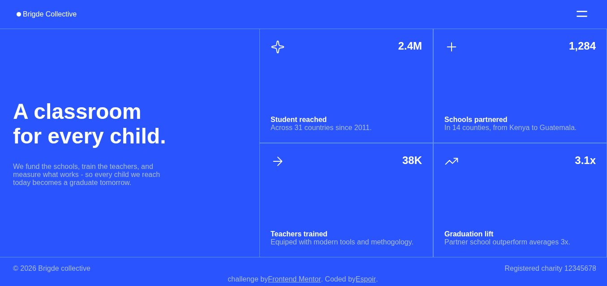
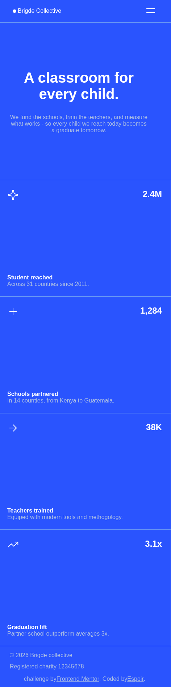

# grid-landing-page-main


# Frontend Mentor - Grid Landing Page Solution

This project is a responsive landing page web application built as a solution to the [Grid landing page challenge on Frontend Mentor](https://www.frontendmentor.io/challenges/grid-landing-page-VN3p_sE8q).

It showcases a modern hero section alongside structured stat cards using responsive CSS Grid and Flexbox layout techniques. The application also provides an interactive mobile navigation menu with smooth toggle behaviors.

Frontend Mentor challenges help developers improve their coding skills by building realistic projects.

## Table of Contents

* [Overview](#overview)
  * [The Challenge](#the-challenge)
  * [Screenshot](#screenshot)
  * [Links](#links)
* [Getting Started](#getting-started)
* [Project Structure](#project-structure)
* [My Process](#my-process)
  * [Built With](#built-with)
  * [What I Learned](#what-i-learned)
* [Author](#author)

## Overview

### The Challenge

Users should be able to:

* View the optimal layout depending on their device's screen size.
* Toggle the mobile navigation menu seamlessly.
* Experience interactive hover, focus, and active states for interactive elements.

### Screenshot




### Links

* Solution URL: [Frontend Mentor solution](https://www.frontendmentor.io/solutions/grid-landing-page)
* Repository URL: [GitHub repository](https://github.com/bigmum0a-wq/grid-landing-page-main)
* Live Site URL: [Grid Landing Page](https://bigmum0a-wq.github.io/grid-landing-page-main/)

## Getting Started

### Run the Project Locally

To run this project locally:

1. Clone this repository:

```bash
git clone https://github.com/bigmum0a-wq/grid-landing-page-main.git
```

2. Navigate to the project directory:

```bash
cd grid-landing-page-main
```

3. Open the application.

The entry point is located in:

```text
index.html
```

You can open the file directly in your browser or use a local development server such as the VS Code Live Server extension.

## Project Structure

```text
grid-landing-page-main
│
├── README.md
├── LICENSE
├── index.html
│
├── assets
│   ├── Designs
│   │   ├── desktop-state.png
│   │   ├── image-desktop-menu-open copy.png
│   │   ├── mobile-state.png
│   │   └── mobile-with-open-menu.png
│   ├── fonts
│   └── images
│       ├── favicon-32x32.png
│       ├── icon-arrow-right.svg
│       ├── icon-close.svg
│       ├── icon-menu.svg
│       ├── icon-plus.svg
│       ├── icon-sparkle.svg
│       └── icon-trending-up.svg
│
└── src
    ├── css
    │   └── styles.css
    └── js
        └── script.js
```

## My Process

### Built With

* Semantic HTML5 markup
* CSS custom properties
* CSS Flexbox
* CSS Grid
* Mobile-first workflow
* Pure JavaScript
* DOM manipulation
* Event listeners
* Toggle menu interactivity
* GitHub Pages for frontend deployment

### What I Learned

Building this project helped me strengthen my understanding of responsive CSS Grid layouts, section alignment, and handling overlay navigation menus with JavaScript.

This project reinforced my knowledge of:

* Structuring complex layouts using CSS Grid and media queries
* Creating an accessible, toggleable mobile navigation bar
* Managing DOM element visibility and state shifts cleanly
* Keeping assets organized within structured directories
* Deploying frontend projects on GitHub Pages

## Author

* Frontend Mentor - [@bigmum0a-wq](https://www.frontendmentor.io/profile/bigmum0a-wq)
